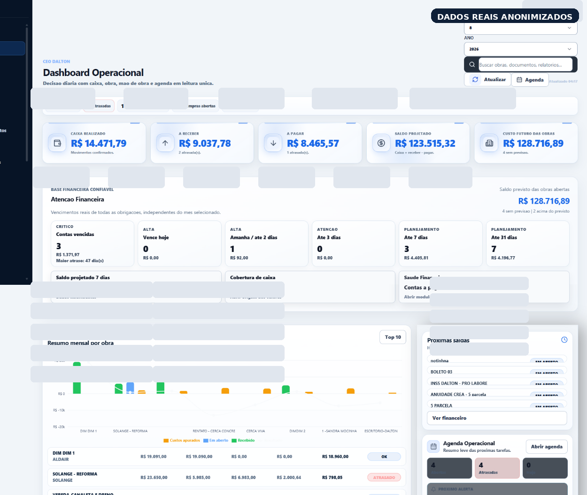
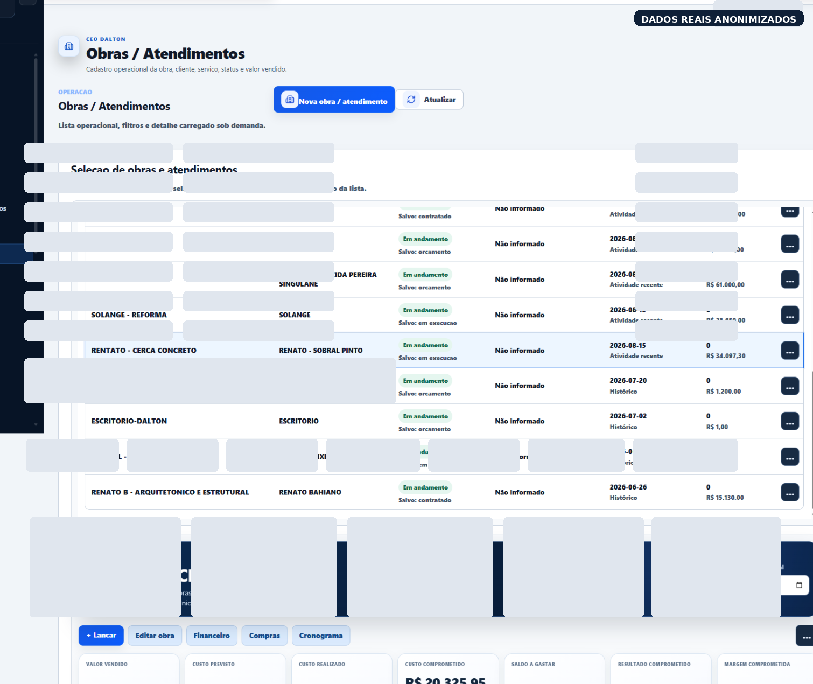
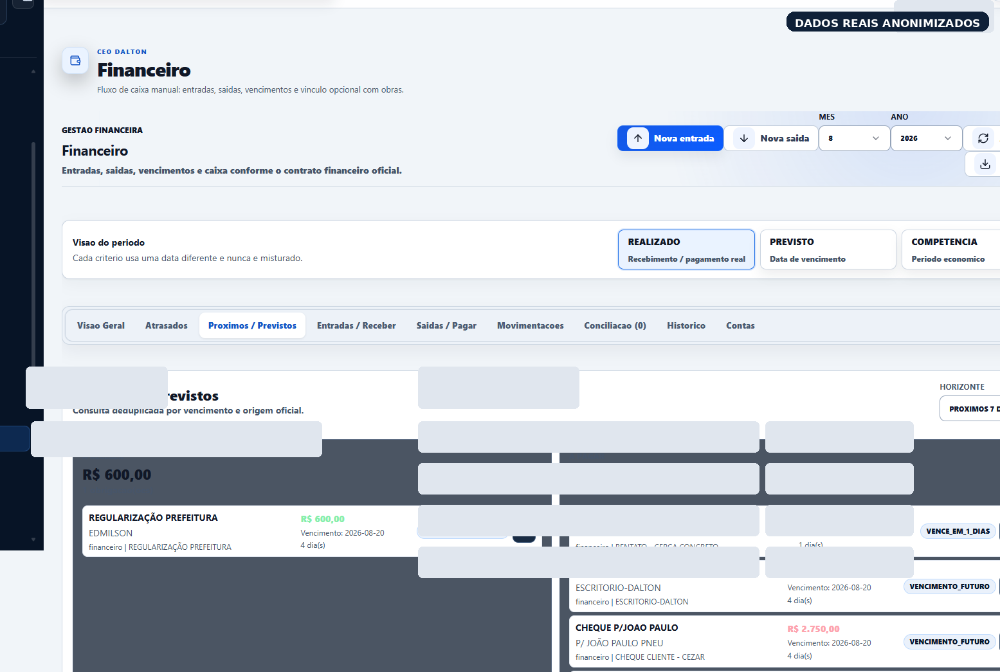
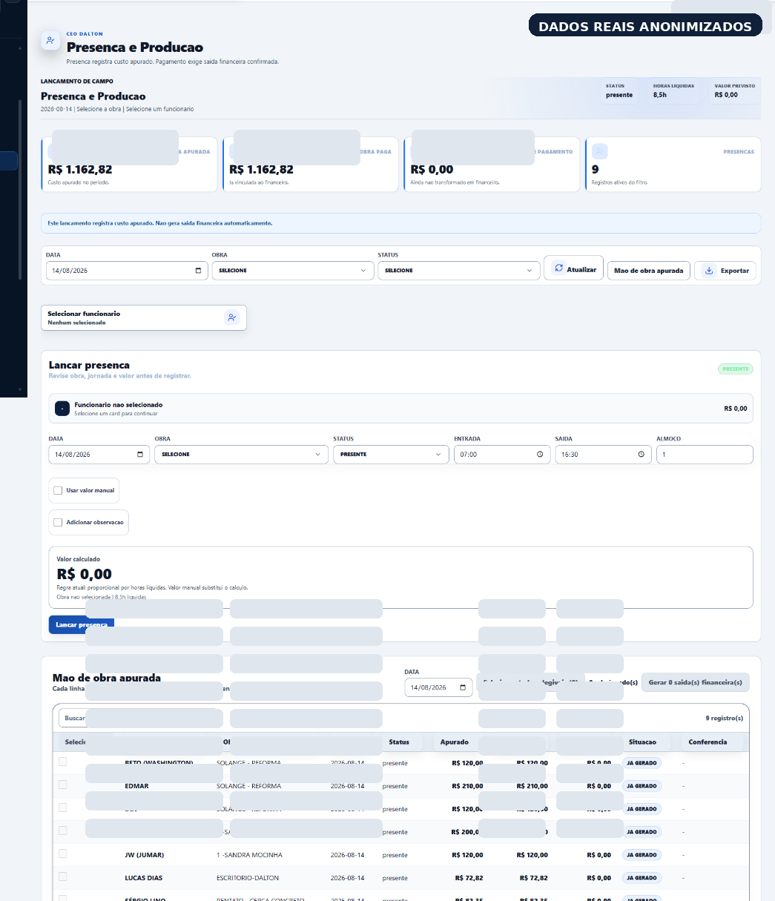
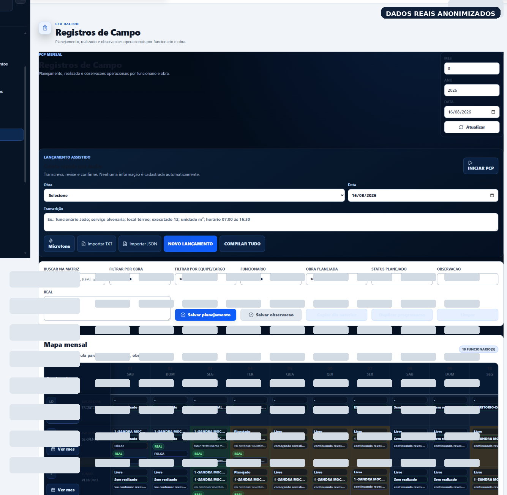
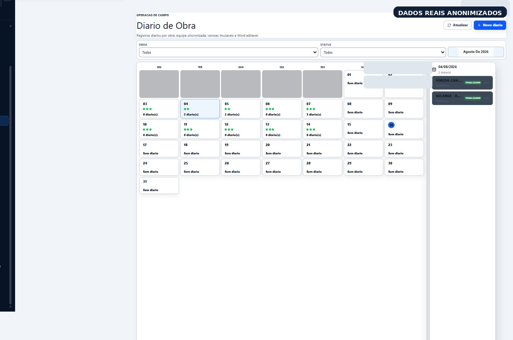

# CEO DALTON

### Sistema empresarial criado a partir de uma operação real

O **CEO DALTON** nasceu de um problema que eu vivenciava diretamente dentro da operação da Dalton Engenharia.

Trabalhando com rotinas financeiras, controles e informações operacionais, percebi que dados importantes estavam distribuídos entre planilhas, documentos, mensagens e controles independentes.

Decidi transformar esses processos em um sistema integrado.

---

## Meu papel

Fui o **único responsável pela concepção e desenvolvimento do projeto**.

Minha atuação envolveu:

- identificação dos problemas operacionais;
- levantamento e modelagem dos processos;
- definição de regras de negócio;
- arquitetura funcional;
- desenho dos módulos;
- priorização de funcionalidades;
- condução da implementação;
- testes e validações;
- investigação e correção de erros;
- evolução do produto a partir do uso real.

Utilizei Inteligência Artificial como ferramenta de aceleração da implementação, investigação técnica e revisão.

As decisões de produto, processos, requisitos, prioridades e validação permaneceram sob minha responsabilidade.

---

# O problema

A empresa precisava conectar informações relacionadas a:

- obras;
- clientes;
- funcionários;
- presença;
- mão de obra;
- financeiro;
- planejamento;
- compras;
- fornecedores;
- orçamentos;
- registros de campo;
- documentos;
- relatórios;
- indicadores.

O objetivo não era criar apenas novas telas.

Era transformar informações isoladas em um **fluxo operacional conectado**.

---

# Visão do sistema

### Fluxo operacional simplificado

**Obra**  
↓  
**Planejamento**  
↓  
**Execução**  
↓  
**Presença / Produção**  
↓  
**Custos**  
↓  
**Financeiro**  
↓  
**Indicadores**  
↓  
**Decisão**

Um registro realizado em uma etapa pode alimentar outras partes da operação.

Isso permite reduzir duplicidade de informação e melhorar a qualidade da gestão.

---

# Principais módulos

- Dashboard executivo
- Clientes
- Obras
- Funcionários
- Presença
- Financeiro
- PCP / planejamento
- Registro de Campo
- Diário de Obras
- Compras
- Fornecedores
- Orçamentos
- Kanban
- Documentos
- Relatórios
- Administração e permissões

---

# Stack e arquitetura

O projeto utiliza tecnologias modernas de aplicações web e sistemas empresariais.

Entre os componentes utilizados no projeto estão:

- React
- TypeScript
- Python
- FastAPI
- PostgreSQL
- Neon
- Docker
- Fly.io
- APIs
- testes automatizados
- geração de documentos
- integrações e automações

Este repositório **não contém o código-fonte de produção**.

O objetivo é apresentar o processo de criação do produto, decisões, problemas enfrentados e resultados.

---

# Um exemplo de pensamento sistêmico

Presença de funcionário não deveria ser apenas um registro isolado.

### Exemplo de encadeamento

**Presença**  
↓  
**Horas / diária**  
↓  
**Custo de mão de obra**  
↓  
**Custo da obra**  
↓  
**Planejado × realizado**  
↓  
**Indicadores**

Ao mesmo tempo, a criação de uma movimentação financeira exige regras próprias e confirmação adequada.

Essa separação entre **evento operacional** e **evento financeiro** foi uma das preocupações do projeto.

---

# Desenvolvimento em ambiente real

O CEO DALTON não foi criado como exercício acadêmico.

O sistema é utilizado dentro da operação da Dalton Engenharia.

Novas necessidades surgem durante o uso e são transformadas em:

### Ciclo de evolução

**Problema**  
↓  
**Análise**  
↓  
**Requisito**  
↓  
**Implementação**  
↓  
**Teste**  
↓  
**Validação**  
↓  
**Uso**  
↓  
**Melhoria**

---

# Alguns desafios encontrados

Durante a evolução do projeto foi necessário lidar com situações como:

- inconsistência de dados;
- duplicidade de registros;
- permissões;
- evolução do banco de dados;
- persistência;
- experiência mobile;
- fluxos financeiros;
- testes;
- deploy;
- segurança;
- backup;
- risco de falha parcial;
- preservação de dados de produção;
- rollback.

Esses problemas fizeram parte do processo real de evolução do sistema.

---

# Uso de IA no desenvolvimento

A Inteligência Artificial foi utilizada como ferramenta de aceleração técnica.

### Processo de trabalho

**Problema**  
↓  
**Análise da operação**  
↓  
**Definição da regra**  
↓  
**Especificação**  
↓  
**Implementação assistida por IA**  
↓  
**Teste**  
↓  
**Análise do resultado**  
↓  
**Correção**  
↓  
**Validação**

A IA auxiliou principalmente em:

- implementação;
- investigação de erros;
- análise técnica;
- revisão;
- geração de alternativas;
- testes;
- documentação.

A responsabilidade pelas decisões, requisitos, regras de negócio, priorização e validação permaneceu comigo.

---

# O que este projeto demonstra

Este projeto representa principalmente minha capacidade de:

- entender uma operação real;
- transformar processos em software;
- estruturar regras de negócio;
- pensar produto;
- trabalhar com sistemas empresariais;
- conduzir implementação;
- utilizar IA profissionalmente;
- investigar problemas;
- testar soluções;
- conectar tecnologia e negócio;
- trabalhar com um sistema em uso real;
- evoluir produto a partir de feedback;
- lidar com riscos de produção.

---

# Evidências visuais do sistema

As imagens abaixo mostram módulos reais do **CEO DALTON** em operação.

Somente dados empresariais e pessoais foram anonimizados. A estrutura, os fluxos e a interface permanecem visíveis.

## Dashboard Operacional

Visão executiva criada para reunir informações financeiras, operacionais e de obras em um único ambiente de decisão.

**O que esta tela demonstra:**
- consolidação de indicadores;
- visão financeira;
- acompanhamento operacional;
- alertas e prioridades;
- leitura de obras;
- atalhos para rotinas recorrentes;
- gráficos para apoio à decisão.

---

## Obras e Atendimentos

Ambiente central para cadastro, acompanhamento e análise das obras e serviços da empresa.

**O que esta tela demonstra:**
- organização das obras em andamento;
- centralização de dados operacionais;
- acompanhamento de custos;
- análise de resultado;
- vínculo entre obra, financeiro, compras, cronograma e equipe;
- visão consolidada de cada atendimento.

---

## Financeiro

Módulo construído para controlar entradas, saídas, vencimentos, previsões e movimentações financeiras conectadas à operação.

**O que esta tela demonstra:**
- entradas e saídas;
- contas previstas;
- vencimentos;
- organização por competência;
- separação entre realizado e previsto;
- integração entre financeiro e obras.

Uma preocupação importante do projeto foi evitar que eventos operacionais gerassem movimentações financeiras irreversíveis sem confirmação adequada.

---

## Presença e Produção

Controle operacional utilizado para registrar presença, horas trabalhadas, custo de mão de obra e vínculo com a obra correta.

**O que esta tela demonstra:**
- registro de presença;
- cálculo de horas e diária;
- apropriação de mão de obra;
- associação entre funcionário e obra;
- conferência antes da geração financeira;
- histórico operacional.

Esse módulo exemplifica um dos princípios do sistema:

**um registro operacional pode alimentar custos e indicadores sem necessariamente gerar uma saída financeira automática.**

---

## Registros de Campo e PCP

Área voltada ao planejamento, realizado e acompanhamento diário da execução.

**O que esta tela demonstra:**
- planejamento mensal;
- registro do realizado;
- observações operacionais;
- acompanhamento por funcionário;
- acompanhamento por obra;
- comparação entre planejamento e execução;
- apoio a lançamentos assistidos.

O objetivo foi transformar informações de campo em dados estruturados para acompanhamento da operação.

---

## Diário de Obra

Calendário operacional criado para organizar registros diários das obras e facilitar a consulta histórica.

**O que esta tela demonstra:**
- registros por obra e data;
- histórico de execução;
- calendário mensal;
- status dos registros;
- centralização das informações de campo;
- preparação de documentação e relatórios.

---

# Evidências documentais

Além das telas, este repositório contém documentos públicos sanitizados que registram a evolução do projeto:

- [CHANGELOG público sanitizado](01_CHANGELOG_PUBLICO_SANITIZADO.md)
- [Marcos de evolução registrados no Git](02_MARCOS_GIT_PUBLICOS.md)

Essas evidências ajudam a demonstrar que o sistema foi evoluído ao longo do tempo e não criado apenas para apresentação de portfólio.

---

# Privacidade e segurança

Este repositório é um **case study público**, e não o repositório real de produção.

Por segurança e confidencialidade, não são publicados:

- código-fonte integral;
- banco de produção;
- dados financeiros;
- dados de clientes;
- dados de funcionários;
- credenciais;
- tokens;
- variáveis de ambiente;
- URLs administrativas;
- backups;
- documentos internos;
- informações comerciais sensíveis.

Um aprofundamento técnico sanitizado pode ser apresentado durante um processo seletivo quando necessário.

---

# Sobre o autor

## Lucas Dias

**Business Systems · SaaS Implementation · Product Operations · AI-assisted Development**

Profissional com atuação prática em operações, financeiro, processos e tecnologia.

Minha principal área de interesse está na interseção entre:

**negócio + sistemas + produto + implantação + IA**

GitHub:

[@lucasdias-product](https://github.com/lucasdias-product)

---

> Este repositório tem finalidade profissional e demonstra decisões, processos e evolução de um sistema empresarial real sem expor informações confidenciais da operação.
